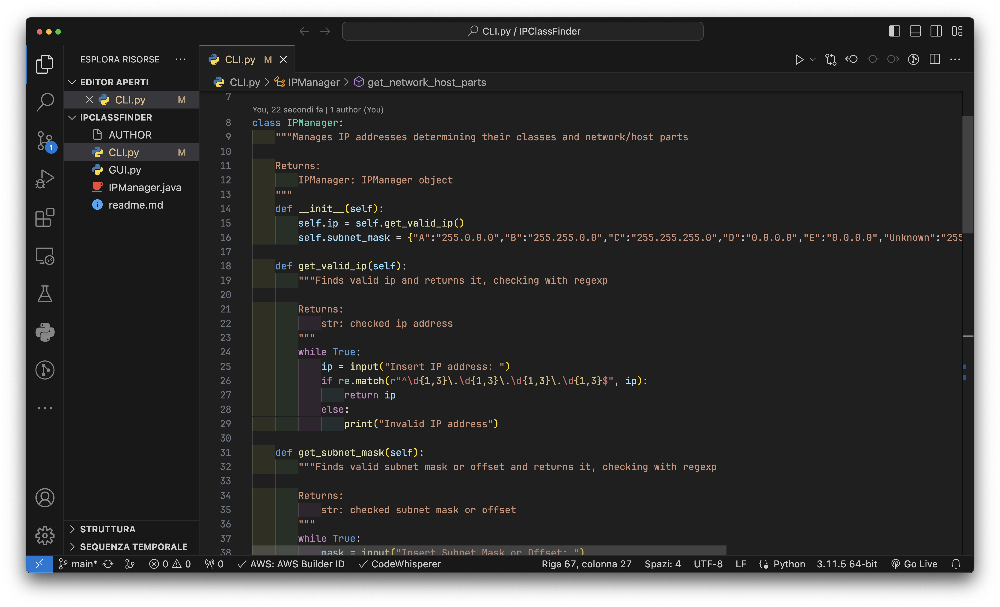
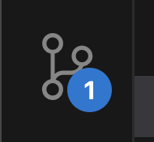
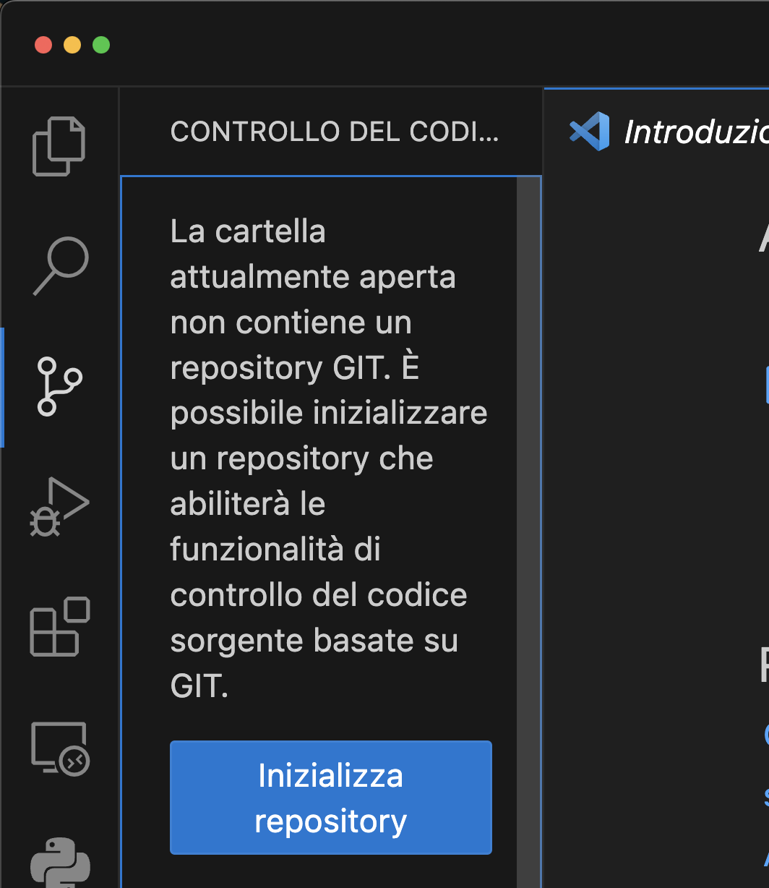
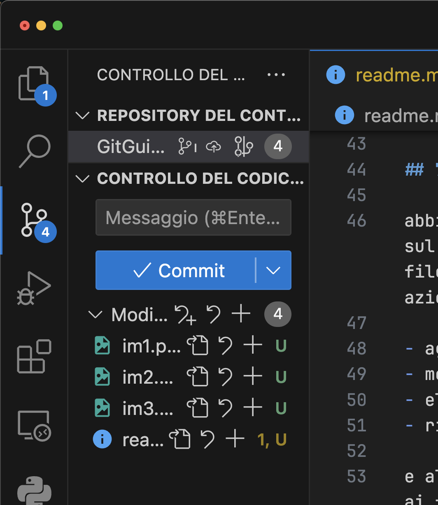
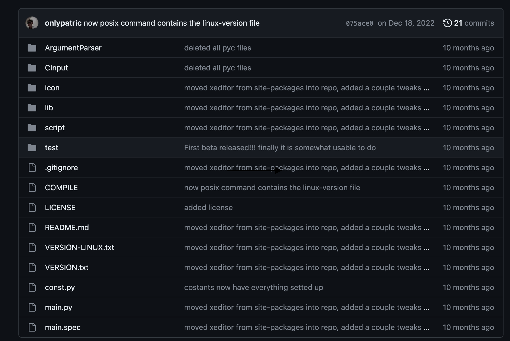
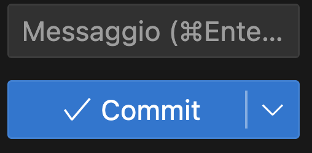

# Guida a GitHub

GitHub è una piattaforma di hosting basata su Git che offre una varietà di strumenti per la gestione del controllo delle versioni e la collaborazione tra sviluppatori.

Ecco come fare:

## 1. **Crea un Account GitHub:**

   Se non hai già un account, vai su [github.com](https://github.com/) e crea un account gratuito.

## 2. **Installa Git:**

- Per Windows: Scarica e installa [https://git-scm.com/downloads](https://git-scm.com/downloads).
- Per macOS: Puoi installare Git utilizzando [Homebrew](https://brew.sh/): `brew install git`
- Per Linux (Ubuntu): `sudo apt-get update` seguito da `sudo apt-get install git`

## 3. **Configura Git:**

Configura il tuo nome utente e indirizzo email (uguali a quelli su [github.com](https://github.com/)):

```bash
git config --global user.name "Il Tuo Nome"
git config --global user.email "tua@email.com"
```

## 4. **Apri Visual Studio Code**

Seleziona il tuo progetto, ad esempio utilizzeremo questo:



## 5. **Seleziona la tab controllo codice sorgente**

Si trova a sinistra nel toolbar, terzo elemento



## 6. **Inizializza repository**

con il pulsante blu "Inizializza repository"



## 7. **Repository generata**

abbiamo creato il primo progetto condivisibile sul cloud di github, ma ora dobbiamo caricare i file tramite l'operazione `git commit`, in un normale progetto esistono 4 tipi di azioni che possono essere fatte ai file:

- aggiunta
- modifica
- eliminazione
- rinominazione

e altri 3 tipi di azioni che possono essere fatte ai file di testo

- aggiunta
- modifica
- eliminazione




L'operazione `git commit` richiede un messaggio di poche parole (in genere max 4/5), dove si indicano brevissimamente i cambiamenti, ad esempio:

- `bug fix`
- `new image`
- `removed class 'AppTest.java'`

generalmente cose che siano veloci da vedere ma che fanno capire a chi vede i cambiamenti cosa è stato fatto, ecco come appare su github



la colonna in mezzo segna tutti i cambiamenti, premendoci sopra fa vedere esattamente tutte le modifiche, rimozioni e aggiunte effettuate.

tornando però a come eseguire il commit, ecco come fare:



Scrivere un messaggio nel box indicato, qualcosa di breve, e poi premere commit.
