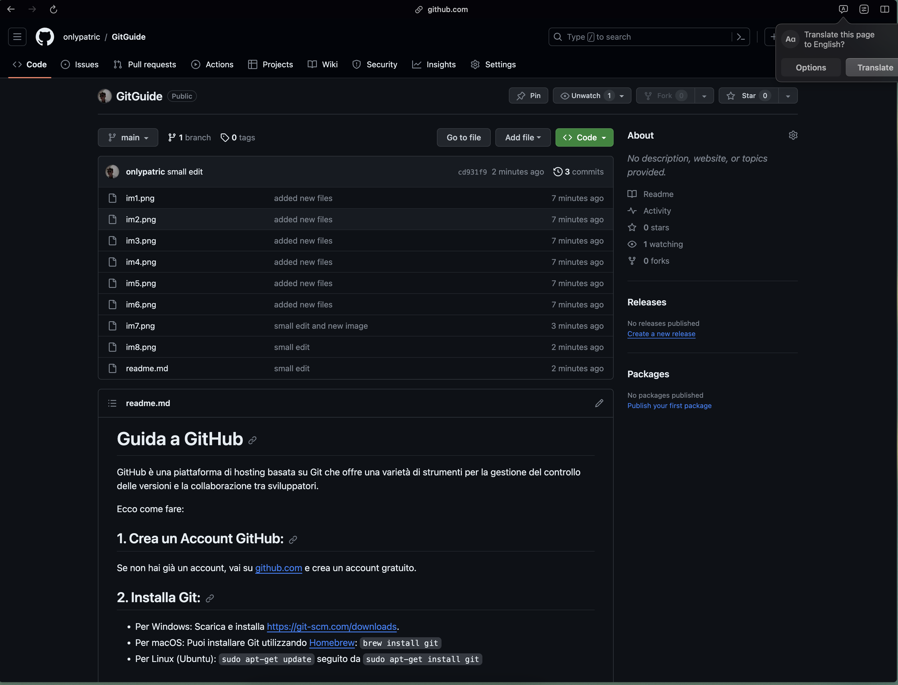

# Guida a GitHub

GitHub è una piattaforma di hosting basata su Git che offre una varietà di strumenti per la gestione del controllo delle versioni e la collaborazione tra sviluppatori.

Ecco come fare:

## 1. **Crea un Account GitHub:**

   Se non hai già un account, vai su [github.com](https://github.com/) e crea un account gratuito.

## 2. **Installa Git:**

- Per Windows: Scarica e installa [https://git-scm.com/downloads](https://git-scm.com/downloads).
- Per macOS: Puoi installare Git utilizzando [Homebrew](https://brew.sh/): `brew install git`
- Per Linux (Ubuntu): `sudo apt-get update` seguito da `sudo apt-get install git`

## 3. **Configura Git:**

Configura il tuo nome utente e indirizzo email (uguali a quelli su [github.com](https://github.com/)):

```bash
git config --global user.name "Il Tuo Nome"
git config --global user.email "tua@email.com"
```

## 4. **Apri Visual Studio Code**

Seleziona il tuo progetto, ad esempio utilizzeremo questo:


## 5. **Seleziona la tab controllo codice sorgente**

Si trova a sinistra nel toolbar, terzo elemento


## 6. **Inizializza repository**

con il pulsante blu "Inizializza repository"


## 7. **Repository generata**

abbiamo creato il primo progetto condivisibile sul cloud di github, ma ora dobbiamo caricare i file tramite l'operazione `git commit`, in un normale progetto esistono 4 tipi di azioni che possono essere fatte ai file:

- aggiunta
- modifica
- eliminazione
- rinominazione

e altri 3 tipi di azioni che possono essere fatte ai file di testo

- aggiunta
- modifica
- eliminazione


L'operazione `git commit` richiede un messaggio di poche parole (in genere max 4/5), dove si indicano brevissimamente i cambiamenti, ad esempio:

- `bug fix`
- `new image`
- `removed class 'AppTest.java'`

generalmente cose che siano veloci da vedere ma che fanno capire a chi vede i cambiamenti cosa è stato fatto, ecco come appare su github


la colonna in mezzo segna tutti i cambiamenti, premendoci sopra fa vedere esattamente tutte le modifiche, rimozioni e aggiunte effettuate.

tornando però a come eseguire il commit, ecco come fare:


Scrivere un messaggio nel box indicato, qualcosa di breve, e poi premere commit.

le prime volte comparirà:


Prima di premere pubblica branch assicurati di aver effettuato il login, premendo il pulsante "profilo" in basso a sinistra della finestra e facendo un login con l'account github premendo nella voce "attiva modifiche cloud"

una volta fatto il login se non è stato ancora fatto si può finalmente premere pubblica branch, potrebbe richiedere qualche altro step di autenticazione ma in genere basta così, porterà a un prompt del genere nella parte alta della finestra:


premendo sul public repository dovrebbe andare tutto bene, in caso contrario reconfigurare user.name e user.mail del comando git agli step iniziali e ritentare.

## 8. **Risultato**

aprendo il tuo profilo github troverai il tuo progetto nel cloud, pronto per essere caricato a velocità di un click



## 9. **cambiamenti, aggiunte, rimozioni del progetto**

il progetto una volta caricato può essere modificato, puoi farlo sia su github se hai l'accesso ma anche da Visual Studio Code, ecco come fare da Visual Studio Code:

- Esegui i tuoi cambiamenti al progetto come se fosse un normale progetto locale
- Torna alla tab controllo codice sorgente
- Scrivere un messaggio nel box in alto
- Premere commit
- Premere il tasto `sync changes`, così da caricare effettivamente i file nel cloud

## 10. **clonare un progetto**

- apri un qualsiasi link repo-github
- premi sul pulsante `code` situato in alto a destra della vista su tutti i file

- premendo sopra compare una vista di due tab, quella che interessa a noi è quella locale
- premere sull'immagine accanto al link che si vede
- aprire una sessione di terminale (quindi cmd/zsh/bash etc..), digitare: `git clone <link> <nomecartella>`

così si clona una repository, se si è aggiunti tra i collaboratori si potranno fare cambiamenti direttamente alla repository,
sennò Visual Studio Code vi offrirà di creare un `fork`, cioè una copia esatta del progetto, solamente caricato sul tuo account github e non quello di chi ha creato il progetto

## 10. **come aggiungere collaboratori**

- aprire la repository github che si possiede
- andare nella sezione settings, ultima in fondo alla barra strumenti

- nella tab `collaborators` o `collaboratori` premere il tasto `add people`

- inserendo l'email del collaboratore verrà invitato, il collaboratore riceverà una notifica sul suo account github (potra accettare l'invito premendo in alto a destra sul tasto inbox, a fianco dell'icona profilo)